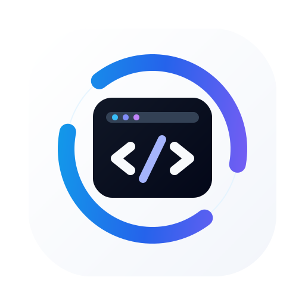
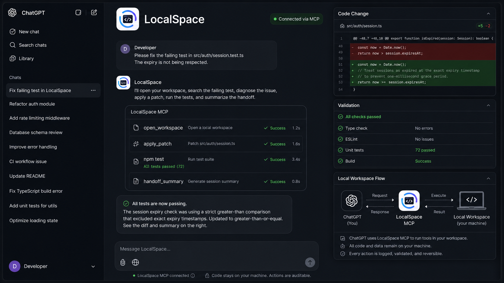

<p align="center">
  <picture>
    
  </picture>
</p>

<h1 align="center">LocalSpace</h1>

<p align="center">A secure local coding workspace for ChatGPT and other MCP hosts.</p>

<p align="center">
  <a href="https://github.com/Alan-512/localspace/actions/workflows/ci.yml"></a>
  <a href="https://github.com/Alan-512/localspace/blob/main/LICENSE"></a>
  <a href="https://github.com/Alan-512/localspace"></a>
</p>

LocalSpace lets ChatGPT, Claude, or another MCP-capable client work directly in
selected folders on your own machine. It exposes file inspection, scoped edits,
code search, Git review, command execution, validation summaries, and handoff
tools through a self-hosted MCP server.

Use it when you want a Codex-style loop in ChatGPT: inspect the repository, read
project instructions, make focused changes, run local tests, review diffs, and
continue long tasks across chat windows.

<p align="center">
  
</p>

> **Security note**
>
> LocalSpace is remote access to selected local folders. Your files stay on your
> machine unless a connected MCP client explicitly asks LocalSpace to read or
> modify them through tool calls. Only connect clients you trust, keep the Owner
> password private, and keep your allowed roots narrow.

---

## Why LocalSpace?

LocalSpace is designed for hybrid human + AI coding sessions where the model is
inside your real development environment, but every capability remains explicit
and inspectable.

- **Local-first coding**: work with your actual projects, package manager, Git
  repository, scripts, and terminal.
- **Workspace-based access**: open one approved folder or managed worktree, then
  reuse the returned `workspaceId` for all later operations.
- **Codex-style editing**: use `read`, `apply_patch`, `exec_command`,
  `write_stdin`, `changes`, and dedicated `git_*` tools.
- **Fast code orientation**: use `project_map`, `entrypoints`, `symbols`,
  `imports`, `references`, and `code_map` before changing unfamiliar code.
- **Workflow guidance**: use `doctor`, `workspace_info`, `next_steps`,
  `validate_plan`, `review_checklist`, `validation_summary`, `task_summary`,
  `final_report`, and `handoff_summary` to keep long sessions grounded.
- **Safety rails**: use filesystem allowlists, OAuth owner approval, Host header
  checks, sensitive-path protection, command risk warnings, danger-command
  approval tokens, and audit logs.

LocalSpace does **not** replace your judgment. Shell access is intentionally
powerful, so treat a connected MCP client like a trusted coding partner with
access to your machine.

---

## Quick Start

### 1. Install requirements

LocalSpace requires:

- Node `>=22.19 <27`
- npm
- Git
- a public HTTPS URL that forwards to the local LocalSpace server

On Windows, portable commands such as `node`, `npm`, and `git` work directly.
Bash-specific commands still require Git Bash, WSL, MSYS2, Cygwin Bash, or an
explicit shell configured with `LOCALSPACE_SHELL`.

### 2. Install and build from this checkout

```bash
npm install
npm run build
```

### 3. Initialize LocalSpace

```bash
node dist/cli.js init
```

During setup, choose:

- the local folders that MCP clients may open as workspaces
- the local port, usually `7676` or `7680`
- the public HTTPS base URL for your tunnel or reverse proxy

Enter the public base URL as an origin only, without `/mcp`:

```text
https://your-tunnel-host.example.com
```

The Owner password is printed during setup and stored in:

```text
~/.localspace/auth.json
```

Keep this password private. LocalSpace also keeps a backward-compatible fallback
for legacy auth files from earlier installs.

### 4. Start your tunnel

LocalSpace does not create the public tunnel for you. Use Cloudflare Tunnel,
ngrok, Pinggy, Tailscale Funnel, or another HTTPS reverse proxy.

Point the tunnel to your local server, for example:

```text
http://127.0.0.1:7680
```

Then configure your MCP client with:

```text
https://your-tunnel-host.example.com/mcp
```

### 5. Start LocalSpace

```bash
node dist/cli.js serve
```

When the MCP client connects, LocalSpace shows an Owner approval page. Enter the
Owner password only when you intentionally want that client to access this
server.

### 6. Open a project from ChatGPT

Ask your MCP client to open one of the approved folders:

```text
@localspace Open ~/work/my-project and inspect the current git status.
```

For long or risky changes, prefer an isolated managed worktree:

```text
@localspace Open ~/work/my-project in worktree mode and implement the next task.
```

---

## Common Commands

```bash
# Check local runtime, config, Git, shell, and dependency health
node dist/cli.js doctor

# Start the MCP server from a built checkout
node dist/cli.js serve

# Start with a temporary public URL override
LOCALSPACE_PUBLIC_BASE_URL="https://new-tunnel.example.com" node dist/cli.js serve

# Persist a stable public URL
node dist/cli.js config set publicBaseUrl https://localspace.example.com
```

If you install LocalSpace as a package, the CLI binary is `localspace`, so the
same commands become `localspace init`, `localspace serve`, and
`localspace doctor`.

---

## Tool Modes

`LOCALSPACE_TOOL_MODE` controls which tools are exposed.

| Mode | Status | Best for |
| --- | --- | --- |
| `hybrid` | Default | ChatGPT coding sessions with Codex-style edits, process tools, code navigation, Git helpers, and workflow summaries. |
| `codex` | Experimental | A smaller Codex-like surface: workspace, read, patch, command, process, changes, and Git tools. |
| `full` | Available | Broader dedicated inspection/search/edit tools plus Git and workflow helpers. |
| `minimal` | Available | A small compatibility surface for hosts that prefer simple read/write/bash-style tools. |

Example:

```bash
LOCALSPACE_TOOL_MODE="hybrid" node dist/cli.js serve
```

See [`docs/configuration.md`](docs/configuration.md) for the complete reference.

---

## What ChatGPT Can Do


In the default `hybrid` mode, ChatGPT can:

- open an approved checkout or managed worktree with `open_workspace`
- inspect project state with `doctor`, `workspace_info`, and `entrypoints`
- read files directly with `read`
- map unfamiliar projects with `project_map` and `code_map`
- search code with `grep`, `glob`, `ls`, `symbols`, `imports`, and `references`
- edit files with `apply_patch`
- run commands with `exec_command` and interact with running processes through
  `write_stdin`
- review changes with `changes`, `git_status`, `git_diff`, and `git_log`
- stage and commit explicit files with `git_add` and `git_commit` when the user
  asks for it
- summarize progress with `session_summary`, `validation_summary`,
  `task_summary`, `final_report`, and `handoff_summary`

The workflow tools are intentionally read-only unless their names clearly imply
mutation, such as `apply_patch`, `exec_command`, `git_add`, or `git_commit`.

---

## Security Model

LocalSpace has multiple safety layers, but it is still a tool for trusted local
development access.

| Layer | Purpose |
| --- | --- |
| Filesystem allowlist | Only configured roots can be opened as workspaces. |
| OAuth owner approval | A connecting MCP client must be approved with your Owner password. |
| Host allowlist | LocalSpace derives allowed hosts from local and public configuration. |
| Sensitive path protection | Write-like tools block `.env`, Git config/hooks, secret-like files, LocalSpace state paths, home roots, and system directories. |
| Command warnings | Risky shell patterns are surfaced before or with command execution. |
| Danger-command approval | High-risk commands require an explicit one-time approval token. |
| Audit log | Important coding actions are recorded for review and session summaries. |

Good allowed roots are narrow project folders such as:

```text
~/work
~/personal/open-source
C:\Users\alice\dev
```

Avoid broad roots such as `~`, `/`, or `C:\`.

Read more in [`docs/security.md`](docs/security.md).

---

## ChatGPT Workflow

A strong LocalSpace session usually follows this loop:

1. Open the target folder once with `open_workspace`.
2. Read returned `AGENTS.md` or equivalent project instructions.
3. Inspect the repo with `workspace_info`, `entrypoints`, `project_map`, or
   `code_map`.
4. Make small, scoped edits with `apply_patch`.
5. Run the most relevant validation commands.
6. Review `changes` or `git_diff` before summarizing.
7. Use `final_report` or `handoff_summary` at natural stopping points.

For detailed model-facing guidance, see
[`docs/chatgpt-coding-workflow.md`](docs/chatgpt-coding-workflow.md).

---

## Documentation

- [`docs/setup.md`](docs/setup.md): setup walkthrough
- [`docs/configuration.md`](docs/configuration.md): commands, environment
  variables, tool modes, widgets, skills, and logging
- [`docs/security.md`](docs/security.md): security model and operational cautions
- [`docs/chatgpt-coding-workflow.md`](docs/chatgpt-coding-workflow.md): how an
  MCP host should use LocalSpace during coding tasks
- [`docs/structured-content.md`](docs/structured-content.md): structured output
  returned by navigation, Git, diagnostics, and workflow tools
- [`docs/gotchas.md`](docs/gotchas.md): common setup and workflow pitfalls

---

## Local Development

For working on LocalSpace itself:

```bash
npm install --include=dev
npm run dev
npm run typecheck
npm test
npm run build
npm run start
```

Before finalizing changes, run at least:

```bash
npm run typecheck
npm test
```

---

## Credits

LocalSpace started as a fork of
[DevSpace](https://github.com/Waishnav/devspace) by
[Waishnav](https://x.com/wshxnv). The original project demonstrated a practical
way to bring local coding workflows to MCP hosts.

LocalSpace builds on that foundation with its own branding, CLI/config paths,
hybrid tool modes, structured output, code navigation, Git helpers, command
safety, audit logs, workflow summaries, and long-session handoff support.

## License

MIT. See [`LICENSE`](LICENSE).
